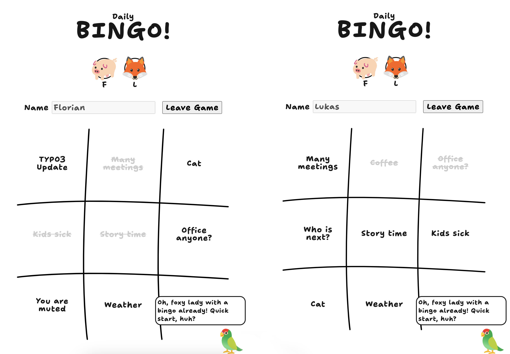

# Daily Bingo!



A bingo game made with Vue, Vite and a realtime [Pocketbase](https://github.com/pocketbase/pocketbase) database.

https://daily-bingo.vercel.app/


## Project Setup

Requirements are [Node](https://nodejs.dev/en/download/) and [pnpm](https://pnpm.io/installation#on-windows).

```sh
git clone https://github.com/fgeierst/daily-bingo.git
cd daily-bingo
pnpm install
```

### Compile and Hot-Reload for Development

```sh
pnpm dev
```

### Compile and Minify for Production

```sh
pnpm build
```

### Run Unit Tests with [Vitest](https://vitest.dev/)

```sh
pnpm test:unit
```

### Run End-to-End Tests with [Playwright](https://playwright.dev)

```sh
# Install browsers for the first run
npx playwright install

# When testing on CI, must build the project first
pnpm build

# Runs the end-to-end tests
pnpm test:e2e
# Runs the tests only on Chromium
pnpm test:e2e --project=chromium
# Runs the tests of a specific file
pnpm test:e2e tests/example.spec.ts
# Runs the tests in debug mode
pnpm test:e2e --debug
```

### Lint with [ESLint](https://eslint.org/)

```sh
pnpm lint
```
